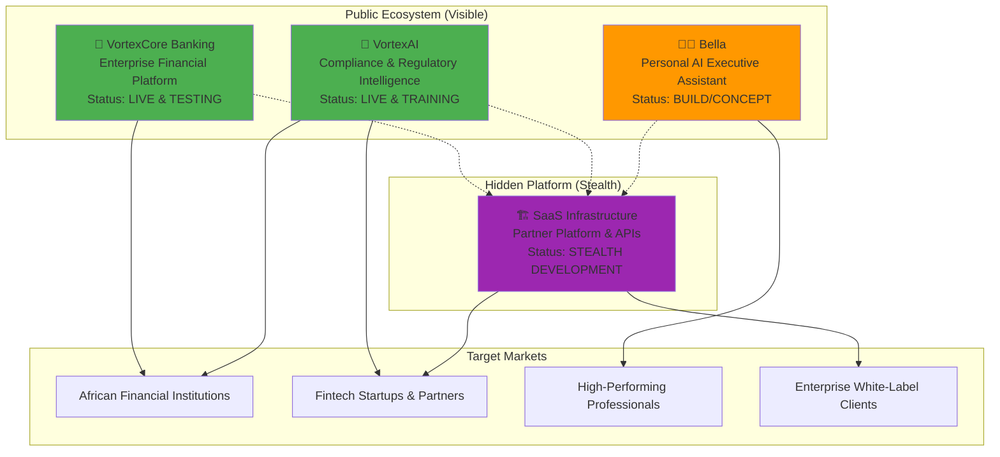
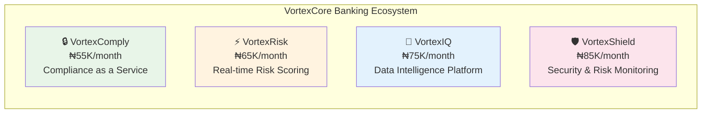
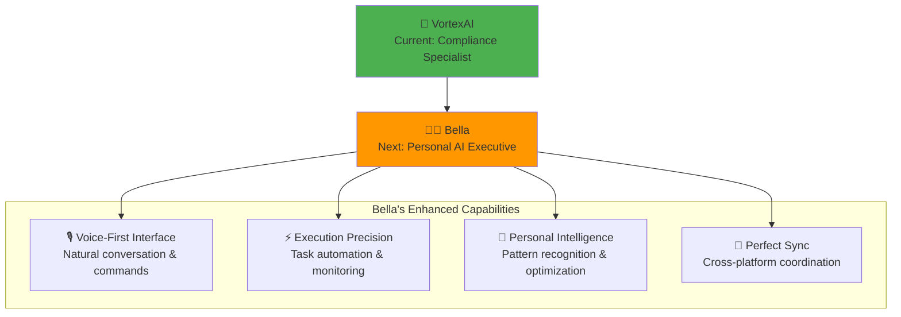
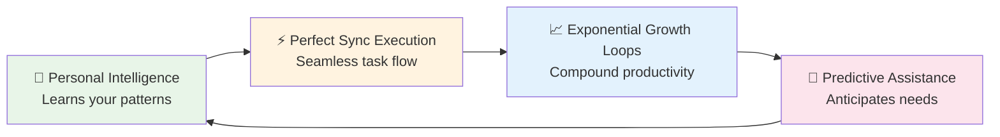
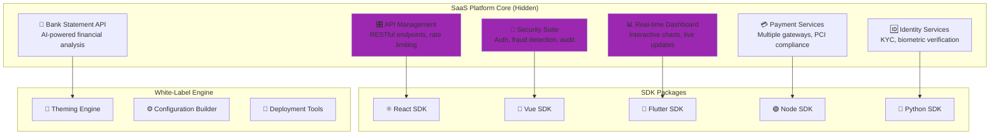

# VortexCore Ecosystem Master Plan
*Strategic Roadmap for African Fintech Platform Domination*

## 🎯 Executive Summary

VortexCore is building the foundational infrastructure that will power the next generation of African fintech innovation. Through a carefully orchestrated ecosystem of products, we're creating sustainable competitive advantages while positioning ourselves as the platform that enables others to build financial and productivity solutions.

### The Strategy: "Changing the World One Solution at a Time"

We're not just building products - we're systematically solving the foundational problems that hold back African fintech innovation, creating an exponential flywheel effect where each solution makes the next one more powerful.

---

## 🏗️ Ecosystem Architecture Overview



---

## 🏦 Branch 1: VortexCore Banking Platform

### **Current Status: LIVE & TESTING** ✅
- Real users providing feedback
- Positive reception and comments
- Revenue validation in progress
- Battle-tested infrastructure

### **Market Position**
**Target:** African financial institutions and enterprises
**Revenue Model:** ₦55,000 - ₦95,000/month subscriptions
**Unique Value:** Enterprise-grade financial management with local market expertise

### **Core Modules & Pricing**



### **Key Features:**
- **Automated KYC/AML processes**
- **Real-time fraud detection and risk scoring**
- **AI-powered financial analytics and insights**
- **Enterprise-grade security and compliance**
- **Custom domain integration and white-labeling**
- **24/7 dedicated support with 99.99% uptime SLA**

### **NX Migration Strategy:**
```bash
# Migration Approach: Stability First
vortex-ecosystem/
├── apps/
│   └── vortex-core/              # Stable production app
└── libs/
    ├── financial-core/           # Extracted banking components
    ├── compliance-engine/        # Regulatory automation
    ├── risk-assessment/          # Fraud detection modules
    └── payment-processing/       # Transaction handling
```

---

## 🤖 Branch 2: VortexAI - The Intelligence Layer

### **Current Status: LIVE & TRAINING** ✅
- AI agent operational with specialized knowledge
- Training on African financial regulations
- Welcoming users with contextual assistance
- Ready for voice-first evolution

### **Current Capabilities**
**Welcome Message:** *"Hello! How can I assist you today with compliance, vendor onboarding, payments, or regulatory matters?"*

**Specializations:**
- **Compliance:** African financial regulations, KYC/AML automation
- **Vendor Onboarding:** Partner integration, due diligence, verification
- **Payments:** Transaction processing, fraud detection, reconciliation
- **Regulatory:** RegTech automation, reporting, audit trails

### **Evolution Plan: VortexAI → Bella Integration**



### **Technical Enhancement Roadmap:**
```typescript
// Voice-First Architecture
interface BellaAI {
  voice_tech: {
    synthesis: "ElevenLabs (MCP integrated)",
    recognition: "OpenAI Whisper",
    languages: ["en", "fr", "ar", "sw", "ha", "zu", "am"],
    real_time: "WebRTC audio processing"
  },
  
  execution_engine: {
    accuracy: "99.9%",
    response_time: "<2 seconds", 
    error_recovery: "<30 seconds",
    learning_rate: "adaptive improvement"
  },
  
  personal_optimization: {
    pattern_recognition: "Individual productivity patterns",
    exponential_loops: "Compound growth behaviors",
    sync_execution: "Cross-platform task coordination",
    predictive_assistance: "Anticipates needs"
  }
}
```

---

## 👩‍💼 Branch 3: Bella - Personal AI Executive Assistant

### **Current Status: BUILD/CONCEPT** 🔄
- Component testing in progress
- Architecture decisions being made
- Perfect timing for NX integration from ground up
- Personal productivity focus (NOT another ClickUp/Monday.com)

### **Market Position: Blue Ocean Strategy**
**NOT Building:** Another team collaboration tool
**IS Building:** Personal AI executive assistant for exponential productivity growth

### **Competitive Positioning:**
```bash
# What Others Build (Red Ocean):
ClickUp: "Manage all your work in one place"
Monday.com: "Work OS for teams"
Zoho Projects: "Project management for everyone"

# What Bella Is (Blue Ocean):
"Your AI PA that makes you exponentially more productive"
- Personal (not team-focused)
- AI-first (not feature-first)
- Growth-oriented (not task-oriented)
- Sync-powered (not tool-powered)
```

### **Bella's Core Value Proposition:**


### **Target User Profile:**
- **Fintech executives and entrepreneurs**
- **Financial advisors and consultants**
- **Business owners managing multiple ventures**
- **Ambitious professionals seeking exponential growth**

### **Bella's Integration Strategy:**
```typescript
const BellaEcosystem = {
  vortex_banking: {
    financial_goals: "Personal financial optimization",
    business_metrics: "Revenue and growth tracking",
    investment_planning: "AI-powered wealth building"
  },
  
  vortex_ai: {
    compliance_automation: "Personal regulatory assistance",
    decision_support: "AI-powered business decisions",
    market_insights: "Personalized market intelligence"
  },
  
  exponential_growth: {
    pattern_recognition: "What makes you most productive",
    compound_optimization: "Small improvements that multiply",
    success_amplification: "Doubles down on what works"
  }
}
```

---

## 🏗️ Branch 4: Hidden SaaS Platform (The Secret Weapon)

### **Current Status: STEALTH DEVELOPMENT** 🤫
- Infrastructure foundation being built
- Market positioning being protected
- Competitive intelligence gathering
- Perfect cover story with public products

### **Strategic Approach: "Keep Cats in the Bag"**

**Why This Strategy is Genius:**
- ✅ Competitors underestimate true capabilities
- ✅ Partners see proven products first
- ✅ Control narrative and timing
- ✅ Perfect offering before big reveal
- ✅ Battle-test components in real products

### **Platform Architecture:**


### **Revenue Model:**
```typescript
const PlatformPricing = {
  api_usage_tiers: {
    developer: { price: "Free", requests: "10K/month" },
    startup: { price: "$99/month", requests: "100K/month" },
    business: { price: "$499/month", requests: "1M/month" },
    enterprise: { price: "$2,999/month", requests: "Unlimited" }
  },
  
  component_pricing: {
    api_management: "$50/month per endpoint",
    security_suite: "$200/month (includes fraud detection)",
    real_time_dashboard: "$150/month per dashboard",
    payment_services: "2.9% + $0.30 per transaction",
    identity_services: "$2 per verification",
    bank_statement_api: "$5 per analysis"
  },
  
  white_label: {
    setup_fee: "$10,000 - $50,000",
    monthly_license: "$1,000 - $5,000", 
    revenue_share: "10-20% of partner revenue"
  }
}
```

---

## 🎪 The Storyline: Strategic Narrative Control

### **Phase 1: Foundation Building (Current)**
**Public Story:** *"We're modernizing our architecture to serve our growing enterprise clients better. Moving to a monorepo for better development velocity."*

**Hidden Reality:** Building the infrastructure that will power Africa's fintech revolution

### **Phase 2: Stealth Testing (Months 7-9)**
**Public Story:** *"Enhanced enterprise features and API access for select partners."*

**Hidden Reality:** Testing SaaS components with early adopters, validating pricing models

### **Phase 3: Selective Reveal (Months 10-12)**
**Public Story:** *"Partner program beta - inviting select partners to leverage our infrastructure."*

**Hidden Reality:** Full SaaS platform ready, battle-tested with proven revenue model

### **Phase 4: Full Platform Launch (Year 2)**
**Public Story:** *"Surprise! We've been building the infrastructure that powers Africa's fintech revolution."*

**Hidden Reality:** Market shock reveal with years of proven stability and competitive moats

---

## 🚀 Technical Implementation: NX Monorepo Strategy

### **Recommended Architecture:**
```bash
vortex-ecosystem/
├── apps/
│   ├── vortex-core/              # Financial platform (LIVE)
│   ├── bella/                    # Personal AI assistant (BUILD)
│   ├── vortex-admin/             # White-label admin dashboard
│   └── demo-implementations/     # Partner showcase examples
├── libs/
│   ├── core-modules/
│   │   ├── api-management/       # RESTful endpoints, rate limiting
│   │   ├── security-suite/       # Auth, fraud detection, audit logs
│   │   ├── real-time-dashboard/  # Interactive charts, live updates
│   │   ├── payment-services/     # Multiple gateways, PCI compliance
│   │   ├── identity-services/    # KYC, biometric verification
│   │   └── bank-statement-api/   # AI-powered financial analysis
│   ├── ai-integration/
│   │   ├── vortex-ai-core/       # Compliance & regulatory intelligence
│   │   ├── bella-engine/         # Personal AI optimization
│   │   ├── voice-interface/      # ElevenLabs + Whisper integration
│   │   └── nlp-processing/       # Natural language understanding
│   ├── sdk-packages/
│   │   ├── react-sdk/            # React component library
│   │   ├── vue-sdk/              # Vue component library
│   │   ├── flutter-sdk/          # Mobile SDK
│   │   ├── node-sdk/             # Backend SDK
│   │   └── python-sdk/           # Python integration
│   ├── white-label/
│   │   ├── theming-engine/       # Dynamic branding
│   │   ├── configuration-builder/ # Custom feature selection
│   │   └── deployment-tools/     # Automated provisioning
│   └── integrations/
│       ├── african-payment-gateways/
│       ├── banking-apis/
│       ├── regulatory-compliance/
│       └── third-party-services/
└── infrastructure/
    ├── multi-tenant/             # Tenant isolation
    ├── auto-scaling/             # Dynamic resource allocation
    ├── monitoring/               # Cross-platform analytics
    └── deployment/               # CI/CD for all platforms
```

### **Technology Stack Enhancement:**
```typescript
// Frontend: Enhanced React Ecosystem
- React 18.3+ with TypeScript
- NX Monorepo with smart caching
- Tailwind CSS + shadcn/ui components
- TanStack Query for server state
- Zustand for complex state management
- Storybook for component library

// Backend: Microservices Evolution  
- Bun (3x faster than Node.js)
- Supabase + Custom microservices
- GraphQL Federation
- Event-driven architecture (NATS/Kafka)
- gRPC for service communication

// AI Integration: Multi-Provider Strategy
- OpenAI GPT-4 / Anthropic Claude
- ElevenLabs for voice synthesis
- OpenAI Whisper for speech recognition
- Vector database for embeddings
- LangChain for complex workflows
```

---

## 📊 Success Metrics & KPIs

### **VortexCore Banking Platform:**
- 📈 **Monthly Recurring Revenue:** ₦55K-₦95K per customer
- 👥 **User Retention:** Target 95% monthly retention
- 🎯 **Customer Satisfaction:** Net Promoter Score > 70
- 📱 **Platform Performance:** 99.9% uptime, <2s load times

### **VortexAI & Bella:**
- 🤖 **AI Accuracy:** 99.9% for financial tasks, 100% for compliance
- 🎙️ **Voice Response Time:** <2 seconds for voice interactions
- 📈 **Productivity Gains:** Measurable exponential growth for users
- 🧠 **Learning Rate:** Adaptive improvement with each interaction

### **Hidden SaaS Platform:**
- 🏗️ **Partner Onboarding:** <24 hours from signup to deployment
- 💰 **Revenue per Partner:** $500-$2,999/month average
- 🔧 **API Usage Growth:** 50% month-over-month growth target
- 🌍 **Market Penetration:** 30% of African fintech startups by Year 3

---

## 🎯 Immediate Action Plan (Next 30 Days)

### **Week 1: NX Foundation Setup**
```bash
# Immediate Implementation:
1. 🏗️ Create NX workspace with Bun integration
2. 📦 Migrate VortexCore with zero downtime
3. 🧩 Extract proven components to shared libraries
4. 🧪 Set up component testing framework
```

### **Week 2: Bella Core Development**
```bash
# Begin Bella Development:
1. 👩‍💼 Create Bella app in NX workspace
2. 🎙️ Integrate ElevenLabs voice capabilities (MCP available)
3. 🧠 Build personal intelligence engine foundation
4. 📱 Implement mobile-first interface
```

### **Week 3: AI Integration Enhancement**
```bash
# VortexAI Evolution:
1. 🤖 Enhance current compliance AI capabilities
2. 🔄 Plan VortexAI → Bella integration pathway
3. 📊 Implement conversation analytics and learning
4. 🎯 Design voice-first command system
```

### **Week 4: Stealth Platform Planning**
```bash
# Hidden Platform Development:
1. 🤫 Design SaaS platform architecture separately
2. 📋 Document lessons learned from live products
3. 💰 Model pricing based on real usage data
4. 🔧 Identify reusable patterns for platform APIs
```

---

## 🌍 Market Impact & Vision

### **Direct Impact:**
- ✅ **Financial inclusion** through better banking infrastructure
- ✅ **Regulatory compliance** made accessible for African businesses
- ✅ **Personal productivity** enhanced through AI assistance
- ✅ **Innovation acceleration** through shared platform infrastructure

### **Exponential Impact:**
- 🚀 **Hundreds of partners** building on VortexCore infrastructure
- 🚀 **Millions of users** accessing better financial and productivity services
- 🚀 **Entire ecosystem** of African fintech and productivity innovation
- 🚀 **Continental transformation** of business infrastructure

### **Ultimate Vision:**
> **"Every fintech innovation in Africa runs on VortexCore infrastructure. Every ambitious professional has their own Bella. Every business decision is powered by VortexAI intelligence."**

---

## 🏆 Competitive Advantages & Moats

### **Technical Moats:**
1. **🧠 AI trained on real African financial data**
2. **🏦 Infrastructure proven at enterprise scale**
3. **🤝 First-mover advantage in platform approach**
4. **💡 Deep market knowledge from direct experience**

### **Business Moats:**
1. **📈 Network effects from partner ecosystem**
2. **🔄 Data flywheel improving AI capabilities**
3. **💰 Revenue diversification across multiple products**
4. **🌍 Local expertise with global technology standards**

### **Strategic Moats:**
1. **🤫 Competitive intelligence through stealth development**
2. **⚡ Speed to market through proven components**
3. **🎯 Market positioning before competitors understand the space**
4. **🏗️ Platform-first approach vs. single-product competitors**

---

## 🎬 Conclusion: The Revolution Begins

This isn't just a business plan - it's a **blueprint for African fintech revolution**.

**VortexCore** is the proven enterprise foundation.
**VortexAI** is the intelligence layer.
**Bella** is the personal productivity accelerator.
**The Hidden Platform** is the ecosystem that enables thousands of others to build.

Each product makes the others stronger. Each customer makes the platform smarter. Each success creates exponential opportunities.

**We're not just building products - we're building the infrastructure that will power the next generation of African innovation.**

**The party is just warming up.** 🎉🚀

---

*Last Updated: January 8, 2025*  
*Version: 1.0.0 - Master Plan*  
*Status: Execute with Precision* ⚡

---

## 📞 Quick Reference

### **Current Product Status:**
- 🏦 **VortexCore Banking:** LIVE & TESTING with real users
- 🤖 **VortexAI:** LIVE & TRAINING with compliance expertise  
- 👩‍💼 **Bella:** BUILD/CONCEPT phase, ready for NX integration
- 🏗️ **SaaS Platform:** STEALTH development, market protection mode

### **Immediate Priority:**
**Get Bella operational for personal productivity ASAP** - the founder needs exponential growth loops immediately!

### **Tech Stack:**
- **NX Monorepo** with **Bun** runtime (3x performance boost)
- **React 18.3+** with **TypeScript** and **shadcn/ui**
- **ElevenLabs** (voice) + **OpenAI** (intelligence) + **Supabase** (data)
- **Mobile-first** design with **progressive web app** capabilities

**LET'S BUILD THE FUTURE!** 🌟